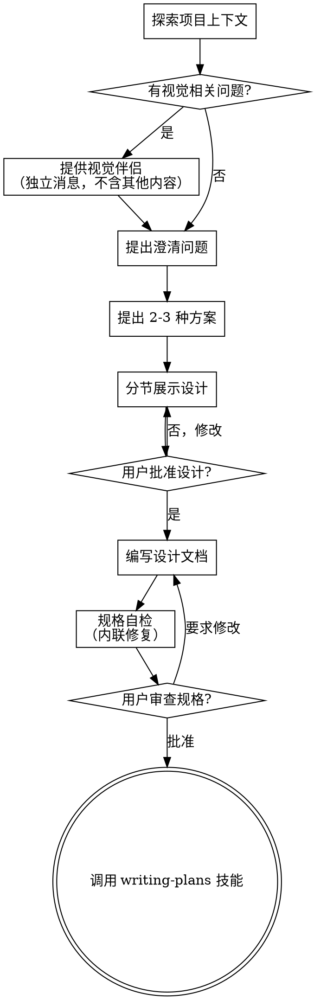

# 腦力激盪：將想法轉化為設計

透過自然的協作對話，幫助將想法轉化為完整的設計和規格說明。

首先了解當前專案的上下文，然後逐一提問來完善想法。一旦你理解了要建構的內容，就展示設計方案並獲得使用者批准。

<HARD-GATE>
在你展示設計方案並獲得使用者批准之前，不要呼叫任何實作技能、編寫任何程式碼、搭建任何專案或採取任何實作行動。這適用於所有專案，無論看起來多簡單。
</HARD-GATE>

## 反模式："這個太簡單了，不需要設計"

每個專案都要經過這個流程。一個待辦事項清單、一個單函數工具、一個設定變更——全都需要。"簡單"的專案恰恰是未經檢驗的假設造成最多浪費的地方。設計可以很簡短（對於真正簡單的專案幾句話就夠了），但你必須展示出來並獲得批准。

## 檢查清單

你必須為以下每個條目建立任務，並按順序完成：

1. **探索專案上下文** — 檢查檔案、文件、最近的 commit
2. **提供視覺伴侶**（如果主題涉及視覺問題）— 這是一條獨立的訊息，不要與釐清問題合併。參見下方的"視覺伴侶"部分。
3. **提出釐清問題** — 每次一個，了解目的/約束/成功標準
4. **提出 2-3 種方案** — 附帶權衡分析和你的推薦
5. **展示設計** — 按複雜度分節展示，每節展示後獲得使用者批准
6. **撰寫設計文件** — 儲存到 `docs/superpowers/specs/YYYY-MM-DD-<topic>-design.md` 並 commit
7. **規格自檢** — 快速內聯檢查佔位符、矛盾、模糊性、範圍（詳見下方）
8. **使用者審查書面規格** — 在繼續之前請使用者審查規格檔案
9. **過渡到實作** — 呼叫 writing-plans 技能建立實作計畫

## 流程圖

**終止狀態是呼叫 writing-plans。** 不要呼叫 frontend-design、mcp-builder 或任何其他實作技能。腦力激盪之後你唯一要呼叫的技能是 writing-plans。

## 流程詳述

**理解想法：**

- 首先查看當前專案狀態（檔案、文件、最近的 commit）
- 在提出詳細問題之前，先評估範圍：如果需求描述了多個獨立子系統（例如"建構一個包含聊天、檔案儲存、計費和分析的平台"），立即指出這一點。不要花時間用問題去細化一個需要先拆分的專案。
- 如果專案規模過大，單個規格說明無法覆蓋，幫助使用者分解為子專案：有哪些獨立的部分，它們之間有什麼關係，應該按什麼順序建構？然後透過正常的設計流程進行第一個子專案的腦力激盪。每個子專案都有自己的規格 → 計畫 → 實作週期。
- 對於範圍適當的專案，每次提一個問題來完善想法
- 盡量使用選擇題，開放式問題也可以
- 每條訊息只提一個問題——如果一個主題需要更多探索，拆分成多個問題
- 重點理解：目的、約束、成功標準

**探索方案：**

- 提出 2-3 種不同的方案及其權衡
- 以對話的方式展示選項，附上你的推薦和理由
- 先展示你推薦的方案並解釋原因

**展示設計：**

- 一旦你認為理解了要建構的內容，就展示設計
- 每個部分的篇幅與其複雜度匹配：簡單的幾句話，複雜的最多 200-300 字
- 每個部分展示後詢問是否正確
- 涵蓋：架構、元件、資料流、錯誤處理、測試
- 隨時準備回頭釐清不明確的地方

**面向隔離和清晰的設計：**

- 將系統拆分為更小的單元，每個單元有一個明確的職責，透過定義良好的介面通訊，可以獨立理解和測試
- 對於每個單元，你應該能回答：它做什麼，如何使用，它依賴什麼？
- 別人能否不看內部實作就理解一個單元的功能？你能否在不影響呼叫者的情況下修改內部實作？如果不能，邊界需要調整。
- 更小、邊界清晰的單元也更便於你工作——你對能一次放入上下文的程式碼推理得更好，檔案越專注你的編輯越可靠。當檔案變大時，這通常意味著它承擔了過多職責。

**在現有程式碼庫中工作：**

- 在提出變更之前先探索現有結構。遵循現有模式。
- 如果現有程式碼存在影響當前工作的問題（例如檔案過大、邊界不清、職責糾纏），在設計中包含有針對性的改進——就像一個優秀的開發者在工作中改進經手的程式碼一樣。
- 不要提議無關的重構。專注於服務當前目標的事情。

## 設計之後

**文件：**

- 將驗證通過的設計（規格說明）寫入 `docs/superpowers/specs/YYYY-MM-DD-<topic>-design.md`
  - （使用者對規格位置的偏好優先於此預設值）
- 如果可用，使用 elements-of-style:writing-clearly-and-concisely 技能
- 將設計文件 commit 到 git

**規格自檢：**
撰寫規格文件後，以全新的視角審視它：

1. **佔位符掃描：** 有沒有"待定"、"TODO"、未完成的章節或模糊的需求？修復它們。
2. **內部一致性：** 各章節之間有矛盾嗎？架構和功能描述匹配嗎？
3. **範圍檢查：** 這是否聚焦到可以用一個實作計畫覆蓋，還是需要進一步拆分？
4. **模糊性檢查：** 有沒有需求可以被兩種方式理解？如果有，選擇一種並明確寫出來。

發現問題就直接內聯修復。無需重新審查——修好繼續推進。

**使用者審查關卡：**
規格自檢完成後，請使用者在繼續之前審查書面規格：

> "規格已撰寫並 commit 到 `<path>`。請審查一下，如果我們在開始撰寫實作計畫之前你想做任何修改，請告訴我。"

等待使用者回覆。如果他們要求修改，做出修改並重新執行規格自檢。只有在使用者批准後才繼續。

**實作：**

- 呼叫 writing-plans 技能建立詳細的實作計畫
- 不要呼叫任何其他技能。writing-plans 是下一步。

## 核心原則

- **每次一個問題** — 不要同時拋出多個問題
- **優先選擇題** — 在可能的情況下比開放式問題更容易回答
- **嚴格遵循 YAGNI** — 從所有設計中移除不必要的功能
- **探索替代方案** — 在做決定之前始終提出 2-3 種方案
- **增量驗證** — 展示設計，獲得批准後再繼續
- **保持靈活** — 有不明確的地方就回頭釐清

## 視覺伴侶

一個基於瀏覽器的伴侶工具，用於在腦力激盪過程中展示原型、圖表和視覺選項。它是一個工具——不是一種模式。接受伴侶意味著它可用於適合視覺呈現的問題；不意味著每個問題都要透過瀏覽器。

**提供伴侶：** 當你預計後續問題會涉及視覺內容（原型、佈局、圖表）時，提供一次以獲得同意：
> "我們接下來討論的一些內容，如果能在瀏覽器中展示給你看可能會更直觀。我可以在討論過程中為你製作原型、圖表、對比圖和其他視覺材料。這個功能還比較新，可能會消耗較多 token。要試試嗎？（需要開啟一個本機 URL）"

**此提議必須是一條獨立的訊息。** 不要將它與釐清問題、上下文摘要或任何其他內容合併。訊息中應該只包含上述提議，沒有其他內容。等待使用者回覆後再繼續。如果他們拒絕，繼續純文字的腦力激盪。

**逐問題決策：** 即便使用者接受了，也要對每個問題單獨決定是使用瀏覽器還是終端。判斷標準：**使用者看到它是否比讀到它更容易理解？**

- **使用瀏覽器** 展示本身就是視覺的內容——原型、線框圖、佈局對比、架構圖、並排視覺設計
- **使用終端** 展示文字內容——需求問題、概念選擇、權衡清單、A/B/C/D 文字選項、範圍決策

關於 UI 主題的問題不一定是視覺問題。"在這個上下文中個性化是什麼意思？"是一個概念問題——使用終端。"哪種嚮導佈局更好？"是一個視覺問題——使用瀏覽器。

如果他們同意使用伴侶，在繼續之前閱讀詳細指南：
`skills/brainstorming/visual-companion.md`
