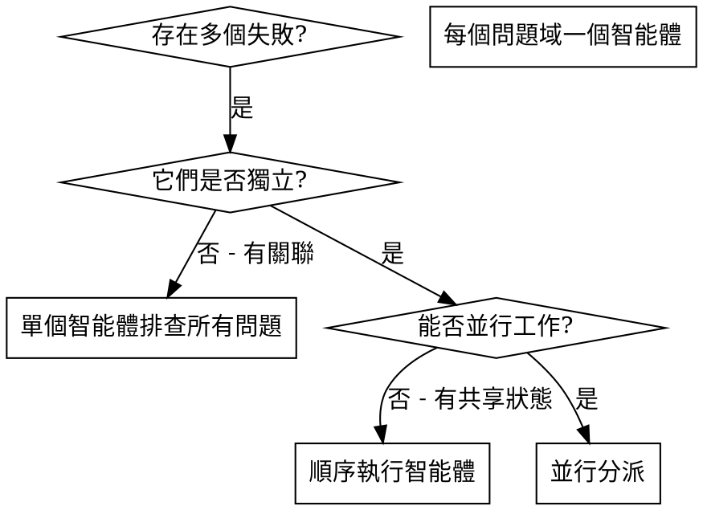

# 並行分派智能體

## 概述

你將任務委派給具有隔離上下文的專用智能體。透過精心設計它們的指令和上下文，確保它們專注並成功完成任務。它們不應繼承你的會話上下文或歷史記錄——你要精確建構它們所需的一切。這樣也能為你自己保留用於協調工作的上下文。

當你遇到多個不相關的失敗（不同的測試檔案、不同的子系統、不同的 bug），逐一排查會浪費時間。每個排查都是獨立的，可以並行進行。

**核心原則：** 每個獨立問題域分派一個智能體，讓它們並發工作。

## 何時使用



**適用場景：**
- 3 個以上測試檔案因不同根因失敗
- 多個子系統獨立出現故障
- 每個問題無需其他問題的上下文即可理解
- 排查之間無共享狀態

**不適用場景：**
- 失敗是相關的（修復一個可能修復其他的）
- 需要理解完整的系統狀態
- 智能體之間會互相干擾

## 模式

### 1. 識別獨立的問題域

按故障分組：
- 檔案 A 測試：工具審批流程
- 檔案 B 測試：批量完成行為
- 檔案 C 測試：中止功能

每個問題域是獨立的——修復工具審批不會影響中止測試。

### 2. 建立聚焦的智能體任務

每個智能體獲得：
- **明確範圍：** 一個測試檔案或子系統
- **清晰目標：** 讓這些測試通過
- **約束條件：** 不修改其他程式碼
- **預期輸出：** 你發現和修復內容的總結

### 3. 並行分派

```typescript
// 在 Claude Code / AI 環境中
Task("修復 agent-tool-abort.test.ts 的失敗")
Task("修復 batch-completion-behavior.test.ts 的失敗")
Task("修復 tool-approval-race-conditions.test.ts 的失敗")
// 三個任務並發執行
```

### 4. 審查與整合

當智能體返回時：
- 閱讀每個總結
- 驗證修復之間沒有衝突
- 執行完整測試套件
- 整合所有變更

## 智能體提示詞結構

好的智能體提示詞應該是：
1. **聚焦的** - 一個清晰的問題域
2. **自包含的** - 包含理解問題所需的所有上下文
3. **明確輸出要求** - 智能體應該返回什麼？

```markdown
修復 src/agents/agent-tool-abort.test.ts 中 3 個失敗的測試：

1. "should abort tool with partial output capture" - 期望訊息中包含 'interrupted at'
2. "should handle mixed completed and aborted tools" - 快速工具被中止而非完成
3. "should properly track pendingToolCount" - 期望 3 個結果但得到 0 個

這些是時序/競態條件問題。你的任務：

1. 閱讀測試檔案，理解每個測試驗證的內容
2. 找到根因——是時序問題還是實際 bug？
3. 修復方式：
   - 用基於事件的等待替換任意逾時
   - 如果發現中止實作中的 bug 則修復
   - 如果測試的是已變更的行為則調整測試期望

不要只是增加逾時時間——找到真正的問題。

返回：你發現了什麼以及修復了什麼的總結。
```

## 常見錯誤

**錯誤做法：太寬泛：** "修復所有測試" - 智能體會迷失方向
**正確做法：具體明確：** "修復 agent-tool-abort.test.ts" - 聚焦的範圍

**錯誤做法：無上下文：** "修復競態條件" - 智能體不知道在哪裡
**正確做法：提供上下文：** 貼上錯誤訊息和測試名稱

**錯誤做法：無約束：** 智能體可能會重構所有程式碼
**正確做法：設定約束：** "不要修改生產程式碼" 或 "只修復測試"

**錯誤做法：模糊的輸出要求：** "修好它" - 你不知道改了什麼
**正確做法：明確要求：** "返回根因和修改內容的總結"

## 不適用的場景

**關聯性失敗：** 修復一個可能修復其他的——先一起排查
**需要完整上下文：** 理解問題需要看到整個系統
**探索性除錯：** 你還不知道什麼壞了
**共享狀態：** 智能體會互相干擾（編輯同一檔案、使用同一資源）

## 實際案例

**場景：** 大規模重構後，3 個檔案中出現 6 個測試失敗

**失敗情況：**
- agent-tool-abort.test.ts：3 個失敗（時序問題）
- batch-completion-behavior.test.ts：2 個失敗（工具未執行）
- tool-approval-race-conditions.test.ts：1 個失敗（執行計數 = 0）

**決策：** 獨立的問題域——中止邏輯、批量完成、競態條件各自獨立

**分派：**
```
智能體 1 → 修復 agent-tool-abort.test.ts
智能體 2 → 修復 batch-completion-behavior.test.ts
智能體 3 → 修復 tool-approval-race-conditions.test.ts
```

**結果：**
- 智能體 1：用基於事件的等待替換了逾時
- 智能體 2：修復了事件結構 bug（threadId 位置不對）
- 智能體 3：新增了等待非同步工具執行完成的邏輯

**整合：** 所有修復互相獨立，無衝突，完整測試套件全部通過

**節省的時間：** 3 個問題並行解決 vs 順序解決

## 核心優勢

1. **並行化** - 多個排查同時進行
2. **聚焦** - 每個智能體範圍窄，需要追蹤的上下文少
3. **獨立性** - 智能體之間互不干擾
4. **速度** - 3 個問題在 1 個問題的時間內解決

## 驗證

智能體返回後：
1. **審查每個總結** - 理解改了什麼
2. **檢查衝突** - 智能體是否編輯了同一段程式碼？
3. **執行完整套件** - 驗證所有修復協同工作
4. **抽查** - 智能體可能犯系統性錯誤

## 實際效果

來自除錯會話（2025-10-03）：
- 3 個檔案中 6 個失敗
- 並行分派 3 個智能體
- 所有排查並發完成
- 所有修復成功整合
- 智能體之間的變更零衝突
