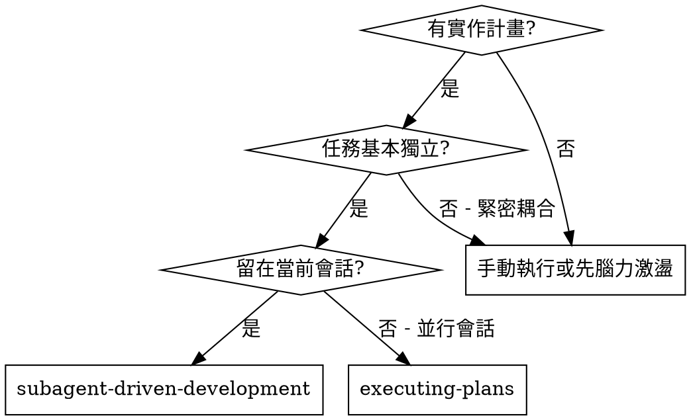
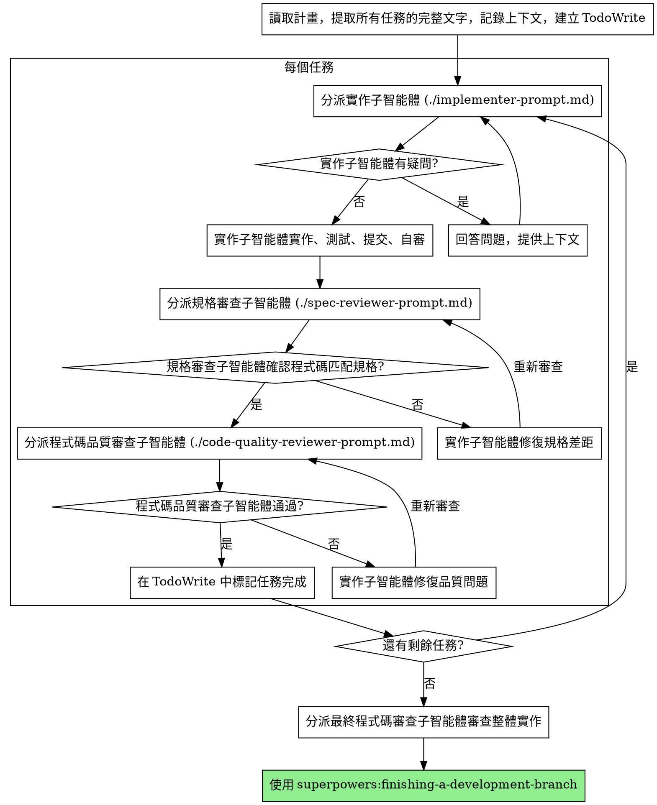

# 子智能體驅動開發

透過為每個任務分派一個全新的子智能體來執行計畫，每個任務完成後進行兩階段審查：先審查規格合規性，再審查程式碼品質。

**為什麼用子智能體：** 你將任務委派給具有隔離上下文的專用智能體。透過精心設計它們的指令和上下文，確保它們專注並成功完成任務。它們不應繼承你的會話上下文或歷史記錄——你要精確建構它們所需的一切。這樣也能為你自己保留用於協調工作的上下文。

**核心原則：** 每個任務一個全新子智能體 + 兩階段審查（先規格後品質）= 高品質、快速迭代

## 何時使用



**與 Executing Plans（並行會話）的對比：**
- 同一會話（無上下文切換）
- 每個任務全新子智能體（無上下文污染）
- 每個任務後兩階段審查：先規格合規性，再程式碼品質
- 更快的迭代（任務間無需人工介入）

## 流程



## 模型選擇

使用能勝任每個角色的最低成本模型，以節省開支並提高速度。

**機械性實作任務**（隔離的函數、清晰的規格、1-2 個檔案）：使用快速、便宜的模型。當計畫編寫得足夠詳細時，大多數實作任務都是機械性的。

**整合和判斷類任務**（多檔案協調、模式匹配、除錯）：使用標準模型。

**架構、設計和審查類任務**：使用最強的可用模型。

**任務複雜度訊號：**
- 涉及 1-2 個檔案且有完整規格 → 便宜模型
- 涉及多個檔案且有整合考慮 → 標準模型
- 需要設計判斷或廣泛的程式碼庫理解 → 最強模型

## 處理實作者狀態

實作子智能體報告四種狀態之一。根據每種狀態進行相應處理：

**DONE：** 進入規格合規性審查。

**DONE_WITH_CONCERNS：** 實作者完成了工作但標記了疑慮。在繼續之前閱讀這些疑慮。如果疑慮涉及正確性或範圍，在審查前解決。如果只是觀察性說明（如"這個檔案越來越大了"），記錄下來並繼續審查。

**NEEDS_CONTEXT：** 實作者需要未提供的資訊。提供缺失的上下文並重新分派。

**BLOCKED：** 實作者無法完成任務。評估阻塞原因：
1. 如果是上下文問題，提供更多上下文並用同一模型重新分派
2. 如果任務需要更強的推理能力，用更強的模型重新分派
3. 如果任務太大，拆分為更小的部分
4. 如果計畫本身有問題，上報給人類

**絕不** 忽略上報或在不做任何更改的情況下讓同一模型重試。如果實作者說卡住了，說明有什麼東西需要改變。

## 提示詞模板

- `./implementer-prompt.md` - 分派實作子智能體
- `./spec-reviewer-prompt.md` - 分派規格合規審查子智能體
- `./code-quality-reviewer-prompt.md` - 分派程式碼品質審查子智能體

## 範例工作流

```
你：我正在使用子智能體驅動開發來執行這個計畫。

[一次性讀取計畫檔案：docs/superpowers/plans/feature-plan.md]
[提取全部 5 個任務的完整文字和上下文]
[用所有任務建立 TodoWrite]

任務 1：Hook 安裝腳本

[獲取任務 1 的文字和上下文（已提取）]
[分派實作子智能體，附帶完整任務文字 + 上下文]

實作者："在我開始之前——hook 應該安裝在使用者級別還是系統級別？"

你："使用者級別（~/.config/superpowers/hooks/）"

實作者："明白了。現在開始實作……"
[稍後] 實作者：
  - 實作了 install-hook 命令
  - 新增了測試，5/5 通過
  - 自審：發現遺漏了 --force 參數，已新增
  - 已提交

[分派規格合規審查]
規格審查者：✅ 符合規格 - 所有需求已滿足，無多餘內容

[獲取 git SHA，分派程式碼品質審查]
程式碼審查者：優點：測試覆蓋好，程式碼整潔。問題：無。通過。

[標記任務 1 完成]

任務 2：恢復模式

[獲取任務 2 的文字和上下文（已提取）]
[分派實作子智能體，附帶完整任務文字 + 上下文]

實作者：[無疑問，直接開始]
實作者：
  - 新增了 verify/repair 模式
  - 8/8 測試通過
  - 自審：一切正常
  - 已提交

[分派規格合規審查]
規格審查者：❌ 問題：
  - 遺漏：進度報告（規格要求"每 100 項報告一次"）
  - 多餘：新增了 --json 參數（未被要求）

[實作者修復問題]
實作者：移除了 --json 參數，新增了進度報告

[規格審查者再次審查]
規格審查者：✅ 現在符合規格

[分派程式碼品質審查]
程式碼審查者：優點：紮實。問題（重要）：魔法數字（100）

[實作者修復]
實作者：提取了 PROGRESS_INTERVAL 常量

[程式碼審查者再次審查]
程式碼審查者：✅ 通過

[標記任務 2 完成]

...

[所有任務完成後]
[分派最終程式碼審查]
最終審查者：所有需求已滿足，可以合併

完成！
```

## 優勢

**與手動執行相比：**
- 子智能體自然遵循 TDD
- 每個任務全新上下文（不會混淆）
- 並行安全（子智能體不會互相干擾）
- 子智能體可以提問（工作前和工作中都可以）

**與 Executing Plans 相比：**
- 同一會話（無交接）
- 持續進展（無需等待）
- 審查檢查點自動化

**效率提升：**
- 無檔案讀取開銷（控制者提供完整文字）
- 控制者精確策劃所需上下文
- 子智能體預先獲得完整資訊
- 問題在工作開始前就被提出（而非工作結束後）

**品質關卡：**
- 自審在交接前發現問題
- 兩階段審查：規格合規性，然後程式碼品質
- 審查循環確保修復確實有效
- 規格合規防止過度/不足建構
- 程式碼品質確保實作良好

**成本：**
- 更多子智能體呼叫（每個任務需要實作者 + 2 個審查者）
- 控制者需要更多準備工作（預先提取所有任務）
- 審查循環增加迭代次數
- 但能及早發現問題（比後期除錯更省成本）

## 紅線

**绝不：**
- 未經使用者明確同意就在 main/master 分支上開始實作
- 跳過審查（規格合規性或程式碼品質）
- 帶著未修復的問題繼續
- 並行分派多個實作子智能體（會衝突）
- 讓子智能體讀取計畫檔案（應提供完整文字）
- 跳過場景鋪設上下文（子智能體需要理解任務在哪個環節）
- 忽視子智能體的問題（在讓它們繼續之前先回答）
- 在規格合規性上接受"差不多就行"（規格審查者發現問題 = 未完成）
- 跳過審查循環（審查者發現問題 = 實作者修復 = 再次審查）
- 讓實作者的自審替代正式審查（兩者都需要）
- **在規格合規性審查通過之前開始程式碼品質審查**（順序錯誤）
- 在任一審查有未解決問題時就進入下一個任務

**如果子智能体提问：**
- 清晰完整地回答
- 必要時提供額外上下文
- 不要催促它們進入實作階段

**如果审查者发现问题：**
- 實作者（同一子智能體）修復
- 審查者再次審查
- 重複直到通過
- 不要跳過重新審查

**如果子智能体失败：**
- 分派修復子智能體並提供具體指令
- 不要嘗試手動修復（上下文污染）

## 整合

**必需的工作流技能：**
- **superpowers:using-git-worktrees** - 必需：在開始前建立隔離工作區
- **superpowers:writing-plans** - 建立本技能執行的計畫
- **superpowers:requesting-code-review** - 審查子智能體的程式碼審查模板
- **superpowers:finishing-a-development-branch** - 所有任務完成後收尾

**子智能體應使用：**
- **superpowers:test-driven-development** - 子智能體對每個任務遵循 TDD

**替代工作流：**
- **superpowers:executing-plans** - 用於並行會話而非同會話執行
