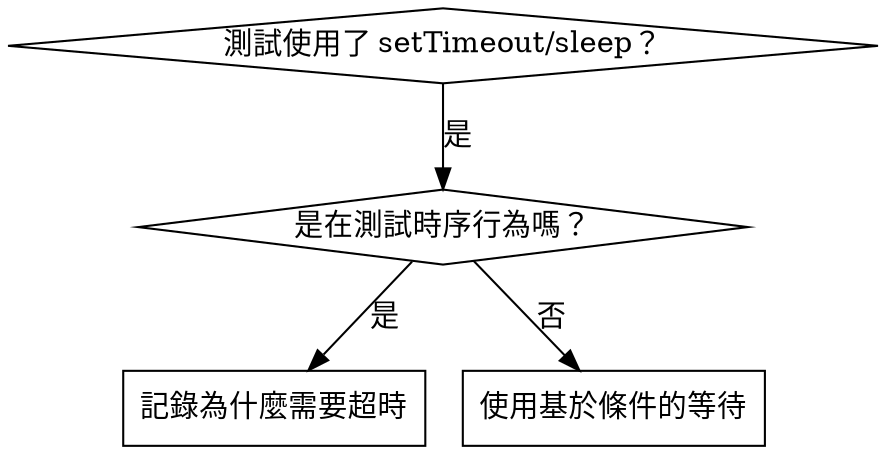

# 基於條件的等待

## 概述

不穩定的測試通常用硬編碼延遲來猜測時序。這會造成競態條件——在快速機器上通過，在高負載或 CI 環境下失敗。

**核心原則：** 等待你真正關心的條件，而不是猜測它需要多長時間。

## 何時使用



**適用場景：**
- 測試中有硬編碼延遲（`setTimeout`、`sleep`、`time.sleep()`）
- 測試不穩定（時而通過，高負載下失敗）
- 並行執行時測試超時
- 等待非同步操作完成

**不適用場景：**
- 測試實際的時序行為（防抖、節流間隔）
- 如果使用硬編碼超時，務必註解說明原因

## 核心模式

```typescript
// ❌ 之前：猜測時序
await new Promise(r => setTimeout(r, 50));
const result = getResult();
expect(result).toBeDefined();

// ✅ 之後：等待條件滿足
await waitFor(() => getResult() !== undefined);
const result = getResult();
expect(result).toBeDefined();
```

## 常用模式速查

| 場景 | 模式 |
|------|------|
| 等待事件 | `waitFor(() => events.find(e => e.type === 'DONE'))` |
| 等待狀態 | `waitFor(() => machine.state === 'ready')` |
| 等待數量 | `waitFor(() => items.length >= 5)` |
| 等待檔案 | `waitFor(() => fs.existsSync(path))` |
| 複合條件 | `waitFor(() => obj.ready && obj.value > 10)` |

## 實作方式

通用輪詢函式：
```typescript
async function waitFor<T>(
  condition: () => T | undefined | null | false,
  description: string,
  timeoutMs = 5000
): Promise<T> {
  const startTime = Date.now();

  while (true) {
    const result = condition();
    if (result) return result;

    if (Date.now() - startTime > timeoutMs) {
      throw new Error(`Timeout waiting for ${description} after ${timeoutMs}ms`);
    }

    await new Promise(r => setTimeout(r, 10)); // 每 10ms 輪詢一次
  }
}
```

參見本目錄下的 `condition-based-waiting-example.ts`，其中包含完整實作和領域專用輔助函式（`waitForEvent`、`waitForEventCount`、`waitForEventMatch`），源自實際除錯過程。

## 常見錯誤

**❌ 輪詢太頻繁：** `setTimeout(check, 1)` —— 浪費 CPU
**✅ 修正：** 每 10ms 輪詢一次

**❌ 沒有超時：** 條件永遠不滿足時無限迴圈
**✅ 修正：** 始終設定超時並提供清晰的錯誤資訊

**❌ 資料過期：** 在迴圈外快取狀態
**✅ 修正：** 在迴圈內呼叫 getter 獲取最新資料

## 何時硬編碼超時是正確的

```typescript
// 工具每 100ms tick 一次——需要 2 次 tick 來驗證部分輸出
await waitForEvent(manager, 'TOOL_STARTED'); // 首先：等待條件
await new Promise(r => setTimeout(r, 200));   // 然後：等待有明確時序依據的行為
// 200ms = 100ms 間隔的 2 次 tick——有文件說明且有充分理由
```

**使用要求：**
1. 首先等待觸發條件
2. 基於已知時序（而非猜測）
3. 註解說明原因

## 實際效果

來自除錯實踐（2025-10-03）：
- 修復了 3 個檔案中的 15 個不穩定測試
- 通過率：60% → 100%
- 執行時間：快了 40%
- 再無競態條件
