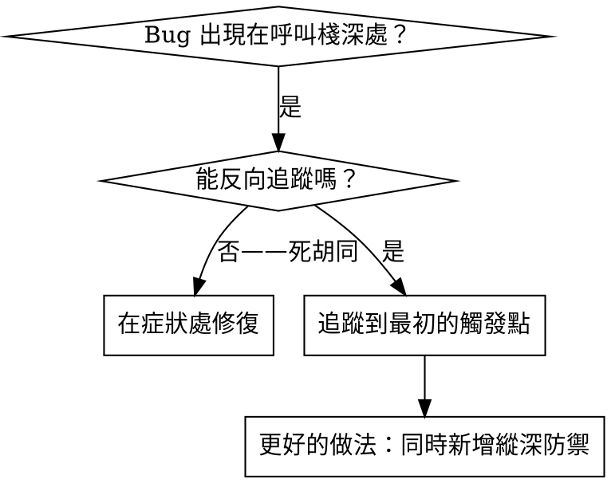
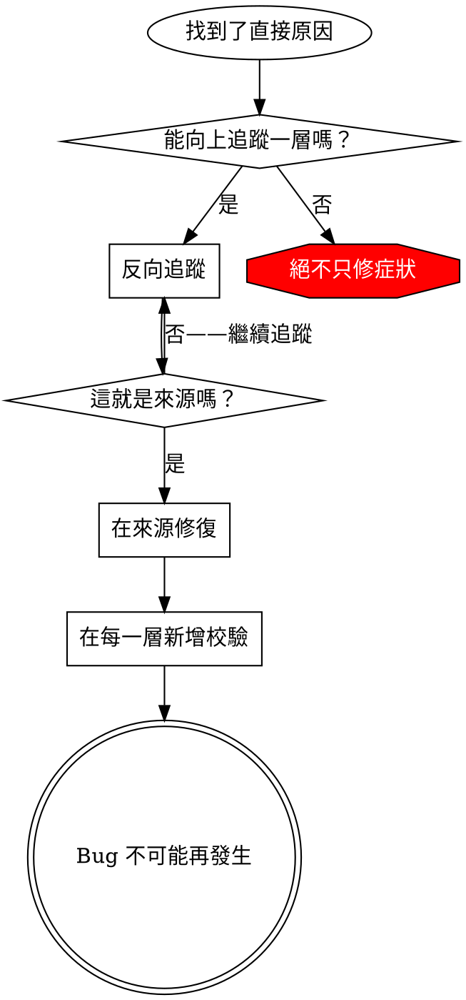

# 根因追蹤

## 概述

Bug 通常表現在呼叫棧深處（在錯誤目錄執行 git init、在錯誤位置建立檔案、用錯誤路徑開啟資料庫）。你的本能是在錯誤出現的地方修復，但那只是治標。

**核心原則：** 沿著呼叫鏈反向追蹤，直到找到最初的觸發點，然後在來源修復。

## 何時使用



**適用場景：**
- 錯誤發生在執行深處（不在入口點）
- 堆疊追蹤顯示很長的呼叫鏈
- 不清楚無效資料從哪裡來
- 需要找到是哪個測試/程式碼觸發了問題

## 追蹤流程

### 1. 觀察症狀
```
Error: git init failed in /Users/jesse/project/packages/core
```

### 2. 找到直接原因
**哪段程式碼直接導致了這個錯誤？**
```typescript
await execFileAsync('git', ['init'], { cwd: projectDir });
```

### 3. 問：誰呼叫了它？
```typescript
WorktreeManager.createSessionWorktree(projectDir, sessionId)
  → 被 Session.initializeWorkspace() 呼叫
  → 被 Session.create() 呼叫
  → 被測試中的 Project.create() 呼叫
```

### 4. 繼續向上追蹤
**傳入了什麼值？**
- `projectDir = ''`（空字串！）
- 空字串作為 `cwd` 會解析為 `process.cwd()`
- 那就是原始碼目錄！

### 5. 找到最初的觸發點
**空字串從哪裡來的？**
```typescript
const context = setupCoreTest(); // 返回 { tempDir: '' }
Project.create('name', context.tempDir); // 在 beforeEach 之前就存取了！
```

## 新增堆疊追蹤

當無法手動追蹤時，新增診斷埋點：

```typescript
// 在有問題的操作之前
async function gitInit(directory: string) {
  const stack = new Error().stack;
  console.error('DEBUG git init:', {
    directory,
    cwd: process.cwd(),
    nodeEnv: process.env.NODE_ENV,
    stack,
  });

  await execFileAsync('git', ['init'], { cwd: directory });
}
```

**重要：** 在測試中使用 `console.error()`（而非 logger——可能不會顯示）

**執行並捕獲：**
```bash
npm test 2>&1 | grep 'DEBUG git init'
```

**分析堆疊追蹤：**
- 找測試檔名
- 找觸發呼叫的行號
- 識別模式（同一個測試？同一個參數？）

## 找出導致污染的測試

如果某些現象在測試期間出現，但你不知道是哪個測試造成的：

使用本目錄下的二分查找腳本 `find-polluter.sh`：

```bash
./find-polluter.sh '.git' 'src/**/*.test.ts'
```

逐個執行測試，在第一個「污染者」處停止。詳見腳本中的使用說明。

## 真實案例：空的 projectDir

**症狀：** `.git` 被建立在 `packages/core/`（原始碼目錄）中

**追蹤鏈：**
1. `git init` 在 `process.cwd()` 中執行 ← cwd 參數為空
2. WorktreeManager 被傳入空的 projectDir
3. Session.create() 傳遞了空字串
4. 測試在 beforeEach 之前存取了 `context.tempDir`
5. setupCoreTest() 初始返回 `{ tempDir: '' }`

**根本原因：** 頂層變數初始化時存取了空值

**修復：** 將 tempDir 改為 getter，在 beforeEach 之前存取時拋出異常

**同時新增了縱深防禦：**
- 第 1 層：Project.create() 校驗目錄
- 第 2 層：WorkspaceManager 校驗非空
- 第 3 層：NODE_ENV 守衛拒絕在 tmpdir 之外執行 git init
- 第 4 層：git init 前記錄堆疊追蹤

## 關鍵原則



**絕不只在錯誤出現的地方修復。** 反向追蹤，找到最初的觸發點。

## 堆疊追蹤技巧

**在測試中：** 使用 `console.error()` 而非 logger——logger 可能被抑制
**操作之前：** 在危險操作之前記錄日誌，而不是在失敗之後
**包含上下文：** 目錄、cwd、環境變數、時間戳
**捕獲堆疊：** `new Error().stack` 能顯示完整的呼叫鏈

## 實際效果

來自除錯實踐（2025-10-03）：
- 透過 5 層追蹤找到了根本原因
- 在來源修復（getter 校驗）
- 新增了 4 層縱深防禦
- 1847 個測試通過，零污染
