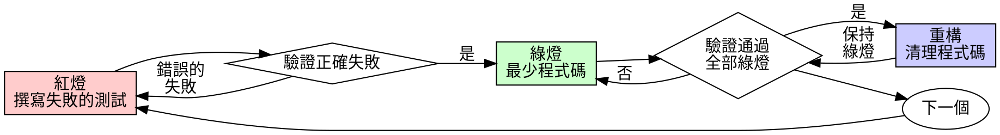

# 測試驅動開發（TDD）

## 概述

先寫測試。看它失敗。寫最少的程式碼讓它通過。

**核心原則：** 如果你沒有看到測試失敗，你就不知道它是否測試了正確的東西。

**違反規則的字面意思就是違反規則的精神。**

## 何時使用

**始終使用：**
- 新功能
- Bug 修復
- 重構
- 行為變更

**例外（需詢問你的人類夥伴）：**
- 一次性原型
- 產生的程式碼
- 設定檔

想著"就這一次跳過 TDD"？停下來。那是在給自己找藉口。

## 鐵律

```
沒有失敗的測試，就不寫生產程式碼
```

先寫了程式碼再寫測試？刪掉它。從頭來過。

**沒有例外：**
- 不要保留作為"參考"
- 不要在寫測試時"改編"它
- 不要看它
- 刪除就是刪除

從測試出發，重新實作。句號。

## 紅-綠-重構



### 紅燈 - 撰寫失敗的測試

寫一個最小的測試來展示期望行為。

<Good>
```typescript
test('retries failed operations 3 times', async () => {
  let attempts = 0;
  const operation = () => {
    attempts++;
    if (attempts < 3) throw new Error('fail');
    return 'success';
  };

  const result = await retryOperation(operation);

  expect(result).toBe('success');
  expect(attempts).toBe(3);
});
```
名稱清晰，測試真實行為，只測一件事
</Good>

<Bad>
```typescript
test('retry works', async () => {
  const mock = jest.fn()
    .mockRejectedValueOnce(new Error())
    .mockRejectedValueOnce(new Error())
    .mockResolvedValueOnce('success');
  await retryOperation(mock);
  expect(mock).toHaveBeenCalledTimes(3);
});
```
名稱模糊，測試的是 mock 而非程式碼
</Bad>

**要求：**
- 一個行為
- 清晰的名稱
- 使用真實程式碼（除非不得已才用 mock）

### 驗證紅燈 - 看它失敗

**必須執行。絕不跳過。**

```bash
npm test path/to/test.test.ts
```

確認：
- 測試失敗（不是報錯）
- 失敗訊息符合預期
- 失敗原因是功能缺失（不是拼寫錯誤）

**測試通過了？** 你在測試已有的行為。修改測試。

**測試報錯了？** 修復錯誤，重新執行直到它正確地失敗。

### 綠燈 - 最少程式碼

寫最簡單的程式碼讓測試通過。

<Good>
```typescript
async function retryOperation<T>(fn: () => Promise<T>): Promise<T> {
  for (let i = 0; i < 3; i++) {
    try {
      return await fn();
    } catch (e) {
      if (i === 2) throw e;
    }
  }
  throw new Error('unreachable');
}
```
剛好夠通過測試
</Good>

<Bad>
```typescript
async function retryOperation<T>(
  fn: () => Promise<T>,
  options?: {
    maxRetries?: number;
    backoff?: 'linear' | 'exponential';
    onRetry?: (attempt: number) => void;
  }
): Promise<T> {
  // YAGNI
}
```
過度設計
</Bad>

不要新增功能、重構其他程式碼或做超出測試要求的"改進"。

### 驗證綠燈 - 看它通過

**必須執行。**

```bash
npm test path/to/test.test.ts
```

確認：
- 測試通過
- 其他測試仍然通過
- 輸出乾淨（沒有錯誤、警告）

**測試失敗了？** 修改程式碼，不是測試。

**其他測試失敗了？** 立即修復。

### 重構 - 清理程式碼

只有在綠燈之後才重構：
- 消除重複
- 改善命名
- 提取輔助函數

保持測試綠燈。不要新增行為。

### 重複

為下一個功能寫下一個失敗的測試。

## 好的測試

| 特質 | 好的 | 差的 |
|------|------|------|
| **最小化** | 只測一件事。名稱中有"和"？拆分它。 | `test('validates email and domain and whitespace')` |
| **清晰** | 名稱描述行為 | `test('test1')` |
| **展示意圖** | 展示期望的 API | 掩蓋了程式碼應該做什麼 |

## 為什麼順序很重要

**"我先寫完再補測試來驗證"**

後寫的測試立即通過。立即通過什麼也證明不了：
- 可能測試了錯誤的東西
- 可能測試的是實作而非行為
- 可能遺漏了你忘掉的邊界情況
- 你從未看到它捕獲 bug

先寫測試迫使你看到測試失敗，證明它確實在測試某些東西。

**"我已經手動測試了所有邊界情況"**

手動測試是臨時的。你以為你測試了所有情況，但是：
- 沒有測試記錄
- 程式碼變更後無法重新執行
- 在壓力下容易遺忘
- "我試過了能跑" 不等於 全面測試

自動化測試是系統性的。它們每次以相同方式執行。

**"刪除 X 小時的工作太浪費了"**

沈沒成本謬誤。時間已經花了。你現在的選擇：
- 刪除並用 TDD 重寫（再花 X 小時，高信心）
- 保留並後補測試（30 分鐘，低信心，可能有 bug）

"浪費"的是保留你無法信任的程式碼。沒有真正測試的可執行程式碼就是技術債。

**"TDD 太教條了，務實意味著靈活變通"**

TDD 就是務實的：
- 在 commit 前發現 bug（比事後除錯快）
- 防止回歸（測試立即發現破壞）
- 記錄行為（測試展示如何使用程式碼）
- 支援重構（放心修改，測試捕獲破壞）

"務實的"捷徑 = 在生產環境除錯 = 更慢。

**"後補測試也能達到相同目的——重要的是精神不是儀式"**

不對。後補測試回答"這段程式碼做了什麼？"先寫測試回答"這段程式碼應該做什麼？"

後補測試受你實作的偏見影響。你測試的是你建構的東西，而非需求要求的。你驗證的是你記得的邊界情況，而非發現的。

先寫測試迫使你在實作前發現邊界情況。後補測試驗證的是你記住了所有情況（你沒有）。

30 分鐘的後補測試 ≠ TDD。你得到了覆蓋率，但失去了測試有效的證明。

## 常見藉口

| 藉口 | 現實 |
|------|------|
| "太簡單了不用測" | 簡單的程式碼也會出 bug。測試只需 30 秒。 |
| "我之後補測試" | 立即通過的測試什麼也證明不了。 |
| "後補測試也能達到相同目的" | 後補測試 = "這做了什麼？" 先寫測試 = "這應該做什麼？" |
| "已經手動測試過了" | 臨時測試 ≠ 系統測試。無記錄，無法重現。 |
| "刪除 X 小時的工作太浪費" | 沈沒成本謬誤。保留未驗證的程式碼就是技術債。 |
| "留作參考，然後先寫測試" | 你會去改編它。那就是後補測試。刪除就是刪除。 |
| "需要先探索一下" | 可以。探索完了扔掉，從 TDD 開始。 |
| "測試難寫 = 設計不清楚" | 聽測試的。難以測試 = 難以使用。 |
| "TDD 會拖慢我" | TDD 比除錯快。務實 = 先寫測試。 |
| "手動測試更快" | 手動測試無法證明邊界情況。每次修改你都得重新測。 |
| "現有程式碼沒有測試" | 你在改進它。為現有程式碼補測試。 |

## 危險訊號 - 停下來，從頭開始

- 先寫了程式碼再寫測試
- 實作完了才補測試
- 測試立即通過
- 無法解釋測試為什麼失敗
- "之後再補"測試
- 說服自己"就這一次"
- "我已經手動測試過了"
- "後補測試也能達到相同目的"
- "重要的是精神不是儀式"
- "留作參考"或"改編現有程式碼"
- "已經花了 X 小時了，刪掉太浪費"
- "TDD 太教條了，我是在務實"
- "這次情況不同，因為……"

**以上所有情況都意味著：刪除程式碼。用 TDD 從頭開始。**

## 範例：Bug 修復

**Bug：** 空信箱被接受了

**紅燈**
```typescript
test('rejects empty email', async () => {
  const result = await submitForm({ email: '' });
  expect(result.error).toBe('Email required');
});
```

**驗證紅燈**
```bash
$ npm test
FAIL: expected 'Email required', got undefined
```

**綠燈**
```typescript
function submitForm(data: FormData) {
  if (!data.email?.trim()) {
    return { error: 'Email required' };
  }
  // ...
}
```

**驗證綠燈**
```bash
$ npm test
PASS
```

**重構**
如果需要，提取验证逻辑以支持多个字段。

## 驗證清單

在標記工作完成之前：

- [ ] 每個新函數/方法都有測試
- [ ] 在實作之前看到每個測試失敗
- [ ] 每個測試因預期原因失敗（功能缺失，不是拼寫錯誤）
- [ ] 為每個測試撰寫了最少程式碼使其通過
- [ ] 所有測試通過
- [ ] 輸出乾淨（沒有錯誤、警告）
- [ ] 測試使用真實程式碼（只在不可避免時用 mock）
- [ ] 覆蓋了邊界情況和錯誤場景

不能全部勾選？你跳過了 TDD。從頭開始。

## 遇到困難時

| 問題 | 解決方案 |
|------|----------|
| 不知道怎麼測試 | 寫出你期望的 API。先寫斷言。問你的人類夥伴。 |
| 測試太複雜 | 設計太複雜。簡化介面。 |
| 必須 mock 所有東西 | 程式碼耦合太緊。使用相依性注入。 |
| 測試 setup 太龐大 | 提取輔助函數。還是複雜？簡化設計。 |

## 除錯整合

發現 bug？寫一個重現 bug 的失敗測試。按 TDD 循環走。測試既證明了修復有效，又防止了回歸。

絕不在沒有測試的情況下修復 bug。

## 測試反模式

新增 mock 或測試工具時，閱讀 @testing-anti-patterns.md 以避免常見陷阱：
- 測試 mock 行為而非真實行為
- 在生產類中新增僅測試用的方法
- 在不理解相依性的情況下使用 mock

## 最終規則

```
生產程式碼 → 測試存在且先失敗
否則 → 不是 TDD
```

沒有你的人類夥伴的許可，沒有例外。
