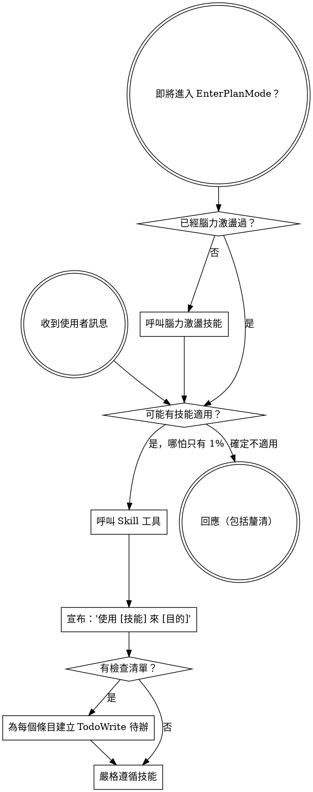

<SUBAGENT-STOP>
如果你是作為子智能體被分派來執行特定任務的，跳過此技能。
</SUBAGENT-STOP>

<EXTREMELY-IMPORTANT>
如果你認為哪怕只有 1% 的可能性某個技能適用於你正在做的事情，你絕對必須呼叫該技能。

如果一個技能適用於你的任務，你沒有選擇。你必須使用它。

這不可協商。這不是可選的。你不能透過合理化來逃避。
</EXTREMELY-IMPORTANT>

## 指令優先級

Superpowers 技能覆蓋預設系統提示行為，但**使用者指令始終具有最高優先級**：

1. **使用者的明確指令**（CLAUDE.md、GEMINI.md、AGENTS.md、直接請求）——最高優先級
2. **Superpowers 技能** ——在衝突處覆蓋預設系統行為
3. **預設系統提示** ——最低優先級

如果 CLAUDE.md、GEMINI.md 或 AGENTS.md 說"不要使用 TDD"，而某個技能說"始終使用 TDD"，遵循使用者的指令。使用者擁有控制權。

## 如何存取技能

**在 Claude Code 中：** 使用 `Skill` 工具。當你呼叫一個技能時，其內容會被載入並呈現給你——直接遵循即可。絕不要用 Read 工具讀取技能檔案。

**在 Copilot CLI 中：** 使用 `skill` 工具。技能從已安裝的外掛中自動發現。`skill` 工具的工作方式與 Claude Code 的 `Skill` 工具相同。

**在 Hermes Agent 中：** 使用 `skill_view` 工具載入技能。Hermes 支援三級漸進式載入：`skills_list` 瀏覽 → `skill_view(name)` 載入完整內容 → `skill_view(name, path)` 查看引用檔案。

**在 Gemini CLI 中：** 技能透過 `activate_skill` 工具啟動。Gemini 在會話開始時載入技能元資料，並按需啟動完整內容。

**在其他環境中：** 查看你的平台文件了解技能的載入方式。

## 平台適配

技能使用 Claude Code 的工具名稱。非 CC 平台：查看 `references/copilot-tools.md`（Copilot CLI）、`references/hermes-tools.md`（Hermes Agent）、`references/codex-tools.md`（Codex）了解工具對應關係。Gemini CLI 使用者透過 GEMINI.md 自動獲得工具對應。

# 使用技能

## 規則

**在任何回應或操作之前呼叫相關或被請求的技能。** 哪怕只有 1% 的可能性某個技能適用，你應該都應該呼叫該技能來檢查。如果呼叫後發現技能不適合當前情況，你不需要使用它。

## 紅線

這些想法意味著停下——你在合理化：

| 想法 | 现实 |
|------|------|
| "這只是一個簡單的問題" | 問題就是任務。檢查技能。 |
| "我需要先了解更多上下文" | 技能檢查在釐清性問題之前。 |
| "讓我先探索一下程式碼庫" | 技能告訴你如何探索。先檢查。 |
| "我可以快速查一下 git/檔案" | 檔案缺少對話上下文。檢查技能。 |
| "讓我先收集資訊" | 技能告訴你如何收集資訊。 |
| "這不需要正式的技能" | 如果技能存在，就使用它。 |
| "我記得這個技能" | 技能會迭代更新。閱讀當前版本。 |
| "這不算一個任務" | 行動 = 任務。檢查技能。 |
| "技能太小題大做了" | 簡單的事會變複雜。使用它。 |
| "讓我先做這一件事" | 在做任何事之前先檢查。 |
| "這樣做感覺很高效" | 無紀律的行動浪費時間。技能防止這一點。 |
| "我知道那是什麼意思" | 知道概念 ≠ 使用技能。呼叫它。 |

## 技能優先級

當多個技能可能適用時，使用此順序：

1. **流程技能優先**（腦力激盪、除錯）- 這些決定如何處理任務
2. **實作技能其次**（前端設計、mcp-builder）- 這些指導執行

"讓我們建構 X" → 先腦力激盪，再使用實作技能。
"修復這個 bug" → 先除錯，再使用領域特定技能。

## 中國特色技能路由

當檢測到以下場景時，**必須**優先呼叫對應的中國特色技能：

| 場景 | 呼叫技能 |
|------|---------|
| 程式碼審查且團隊使用中文溝通 | **superpowers:chinese-code-review** |
| 使用 Gitee/Coding/極狐 GitLab | **superpowers:chinese-git-workflow** |
| 撰寫中文技術文件或 README | **superpowers:chinese-documentation** |
| 撰寫 git commit message（中文專案） | **superpowers:chinese-commit-conventions** |
| 建構 MCP 伺服器/工具 | **superpowers:mcp-builder** |

**判斷依據：**
- 專案中有中文註解、中文 README、或 .gitee 目錄 → 啟用中文系列技能
- commit 歷史中有中文 → 使用中文提交規範
- 使用者用中文交流 → 所有輸出使用中文，優先考慮中國特色技能

中國特色技能與翻譯技能**疊加使用**，不互斥。例如：做程式碼審查時，同時使用 requesting-code-review（流程）+ chinese-code-review（風格）。

## 技能類型

**剛性的**（TDD、除錯）：嚴格遵循。不要偏離紀律。

**靈活的**（模式）：根據上下文調整原則。

技能本身會告訴你它屬於哪種。

## 使用者指令

指令說明做什麼，而非怎麼做。"新增 X"或"修復 Y"不意味著跳過工作流。
